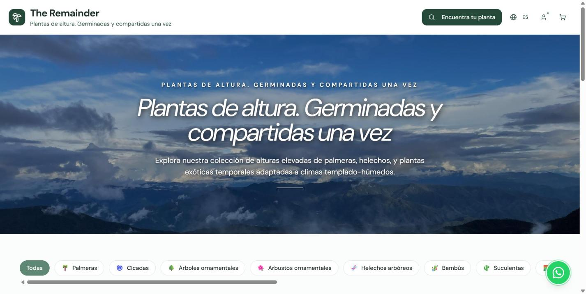
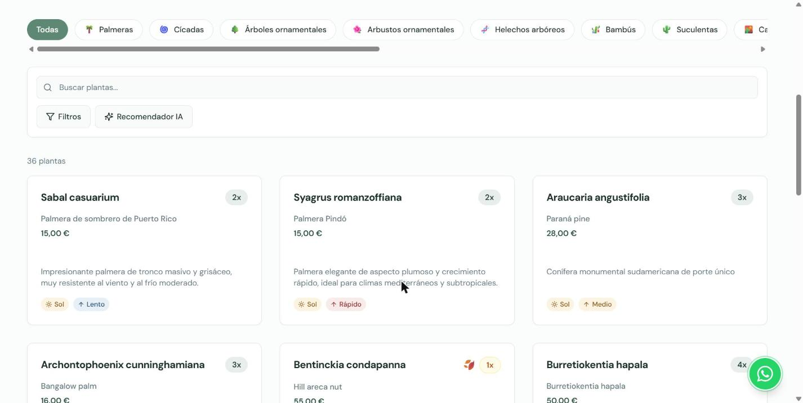
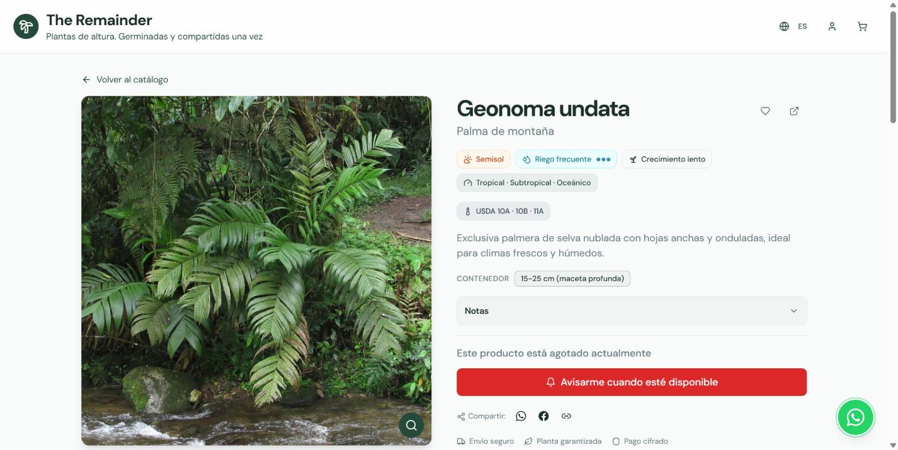

<div align="center">

# The Remainder

**Tienda online de plantas de altura — palmeras, cícadas y helechos arbóreos
germinados y compartidos una vez.**

[**theremainder.pl**](https://theremainder.pl) · Envío a España y Europa

</div>

---

## Qué es esto

The Remainder es un **e-commerce en producción**. Vende ejemplares raros de
plantas de alta montaña: especies de selva nublada, palmeras de altura y
coníferas que no se encuentran en un centro de jardinería.

El catálogo no es infinito a propósito. Cada especie se germina en pequeñas
tandas y se comparte una vez — de ahí el nombre, y de ahí que las fichas lleven
un contador de existencias real (`2x`, `3x`) en lugar de un "disponible"
genérico.

La tienda está viva y operativa en **[theremainder.pl](https://theremainder.pl)**.

---

## Cómo se ve

### Catálogo

Portada con el catálogo completo, navegación por categorías (palmeras, cícadas,
árboles y arbustos ornamentales, helechos arbóreos, bambús, suculentas) y
buscador.



### Búsqueda y filtros

Buscador por nombre, filtros por características de cultivo y un recomendador
asistido por IA para quien no sabe qué especie encaja con su clima. Cada tarjeta
muestra nombre científico, nombre común, precio, existencias y las dos
condiciones que más importan: exposición solar y velocidad de crecimiento.



### Ficha de planta

Cada ejemplar lleva su ficha de cultivo completa: exposición, frecuencia de
riego, ritmo de crecimiento, clima de origen, **zonas de rusticidad USDA** y
tamaño del contenedor. Si está agotado, se puede pedir aviso de reposición.



---

## Qué hace

| Área | Detalle |
|---|---|
| **Catálogo** | Búsqueda con sinónimos, filtros por condiciones de cultivo, categorías, recomendador por IA |
| **Venta** | Carrito, checkout con Stripe, reservas de stock, cálculo de envío, facturación con numeración por series |
| **Subastas** | Ejemplares únicos con pujas, depósito, cierre automático y liquidación |
| **Jardín** | Colecciones privadas y compartibles, registro de germinación, diarios de cultivo, listas de deseos |
| **Confianza** | Verificación de vendedores, reputación, moderación de contenido, disputas y detección de fraude |
| **Operación** | Back-office con pedidos, inventario, roles y permisos, auditoría y analítica |
| **Idiomas** | Español e inglés |

---

## Stack

**Frontend** — React 18 · TypeScript · Vite 5 · Tailwind CSS · shadcn/ui ·
React Router · TanStack Query · i18next · Zod

**Backend** — Supabase (PostgreSQL + Auth + Storage) con **40 edge functions**
en Deno y **128 migraciones** versionadas

**Pagos** — Stripe (checkout, Connect para vendedores, webhooks)

Toda la lógica sensible —precios, stock, pujas, liquidaciones, facturas— vive en
el servidor. El cliente nunca es la fuente de verdad, y el acceso a datos está
cerrado con RLS a nivel de fila.

---

## Arrancar en local

```bash
git clone https://github.com/guillermocubells/theremainder-2.git
cd theremainder-2
npm install
npm run dev
```

Necesitas un `.env` con las credenciales de tu propio proyecto de Supabase:

```bash
VITE_SUPABASE_URL=https://<tu-proyecto>.supabase.co
VITE_SUPABASE_PUBLISHABLE_KEY=<tu-clave-anon>
VITE_SUPABASE_PROJECT_ID=<tu-project-id>
```

Las migraciones de `supabase/migrations/` reconstruyen el esquema completo, y
`scripts/seed-categories.sql` siembra las categorías iniciales.

| Comando | Qué hace |
|---|---|
| `npm run dev` | Servidor de desarrollo |
| `npm run build` | Build de producción |
| `npm run preview` | Sirve el build localmente |
| `npm run lint` | ESLint |

---

## Estructura

```
src/
  components/     Componentes por dominio (garden, wishlist, admin, shared…)
  pages/          Una página por ruta
  hooks/          Lógica de datos y estado
  config/         Configuración centralizada de la tienda
  i18n/locales/   Traducciones es / en
supabase/
  functions/      40 edge functions (Deno)
  migrations/     128 migraciones SQL
docs/             Documentación y capturas
scripts/          Semillas y utilidades
```

---

## Estado

En producción. El repositorio es público como muestra de trabajo; no busca
contribuciones externas.

Hay 15 ficheros de test y un `vitest.config.ts`, pero **vitest no está declarado
en `devDependencies`** — hace falta añadirlo antes de poder ejecutarlos.

---

## Legal

Tienda operada desde España, sujeta a la normativa española y europea de
comercio electrónico y protección de datos. Las condiciones de venta, la
política de privacidad y la información de envíos están publicadas en
[theremainder.pl](https://theremainder.pl).

El código se publica como muestra de trabajo. La marca, los textos y las
fotografías de las plantas no son de uso libre.
